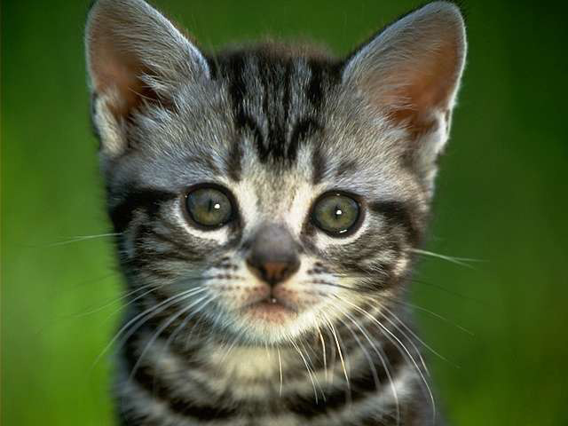
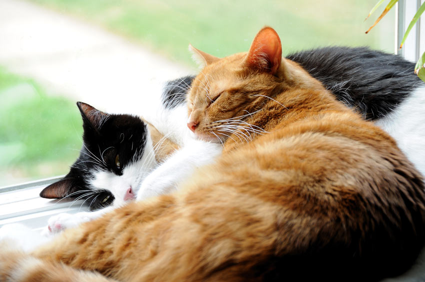

Cats
====

Need a cuddly, furry friend? Look no further, adopt a cat today!

We have a wide range of purring pets available at our shelter.
We have kittens, adolescents, and adult cats, and they each 
possess unique personalities. 

Cat Adoption Prices
-------------------
======================== =======
Cats                      
======================== =======
Kittens under 1-year-old $75.00
Cats                     $50.00
Bonded Pair              $85.00
======================== =======

Martin
------

.. figure:: normancat.png
    :width: 50%

Meet Martin! He is extremely smart, sweet, and silly. He enjoys sleeping 
in the sun, playing with laser pointers, and to eat! He loves to meet 
new people, and is not shy when it comes to greeting others with a good 
rub to the ankle.

**Pet Details:**
	* Type: Cat
	* Breed: Domestic Longhair
	* Sex: Male
	* Age: 3 years
	* Color: Grey Tiger
	* Weight: 15.3 lbs.
	* Spayed/Neutered: Yes
	* Declawed: Yes

**Personality Details:**
	* Extremely smart, sweet, and silly
	* Very outgoing
	* Will do well in a home with or without children

Polly
------

Precious Polly is what we like to call her here at the shelter! She is
a lover, is smart, and loves to play. Since she is just a kitten, she 
still needs to be spayed and declawed.

**Pet Details:**
	* Type: Kitten
	* Breed: Domestic Shorthair
	* Sex: Female
	* Age: 7 months
	* Color: Grey Tiger
	* Weight: 6.4 lbs.
	* Spayed/Neutered: No
	* Declawed: No

**Personality Details:**
	* Cuddly and loves to sleep in laps
	* Takes time to adjust to new people
	* Very smart and loves to play
	* Will do well in any home after she adjusts.

Rascal and Rebel
----------------

Don't let their names fool you, Rascal and Rebel are two of our most 
well-behaved felines in the shelter. *They are bonded together, so they
must be adopted as a pair.*

**Rascal's Details:**
	* Type: Cat
	* Breed: Domestic Medium Hair
	* Sex: Female
	* Age: 2 years
	* Color: Orange Tiger
	* Weight: 16.1 lbs.
	* Spayed/Neutered: Yes
	* Declawed: Yes

**Personality:**
	* Loves to nap and snuggle with Rebel.
	* Loves to meet new people.
	* Very smart and well-behaved.
	* Will do well in any home.

**Rebel's Details:**
	* Type: Cat
	* Breed: Domestic Shorthair
	* Sex: Male
	* Age: 2.5 years
	* Color: Black
	* Weight: 16.13 lbs.
	* Spayed/Neutered: Yes
	* Declawed: Yes

**Personality:**
	* Loves to nap and snuggle with Rascal.
	* Shy, but very loyal to owners.
	* Very smart and well-behaved.
	* Will do better in a home with more mature individuals.

Find a Pet
----------

.. toctree::
   :maxdepth: 2

   dogs
   other_animals
