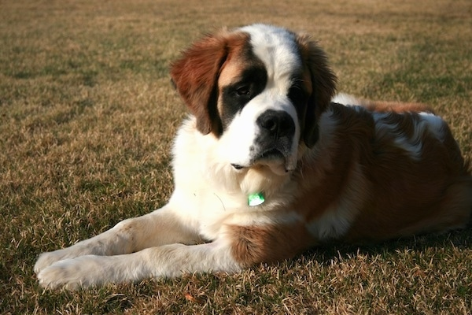
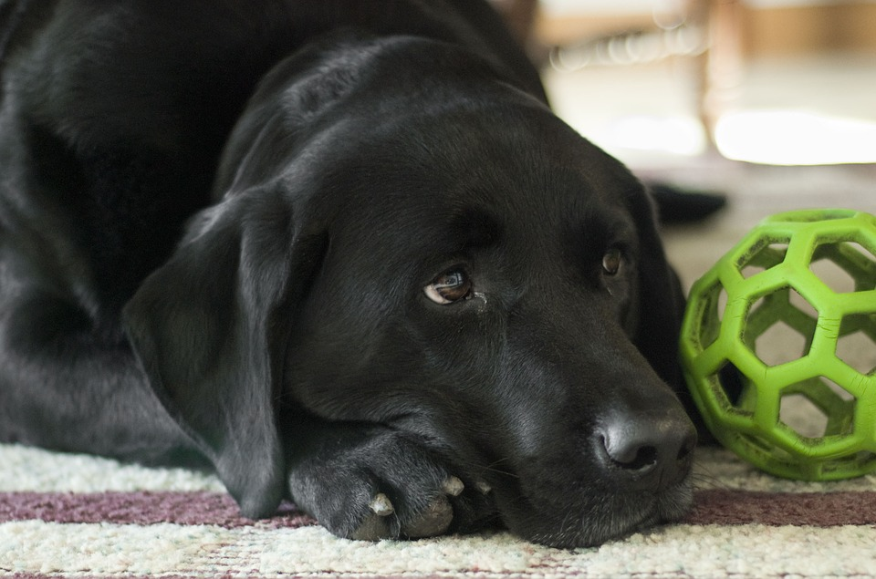

Dogs
====

Everyone Needs a Man's Best Friend

Is there anything better than being greeted by a wagging tail
when you get home from work? No, there isn't. We have plenty
of pups and dogs that are looking for their forever home. 

Dog Adoption Prices
-------------------
======================== =======
Dogs                     Price 
======================== =======
Puppies under 1-year-old $175.00
Dogs                     $125.00
Dogs older than 6 years  $50.00
Bonded Pair              $215.00
======================== =======

Tank
----

This is Tank. He came to us from a family who realized that this pup 
was going to outgrow their home very quickly. Since he is only a puppy,
he has yet to be neutered.

**Pet Details:**
	* Type: Puppy
	* Breed: Saint Bernard
	* Sex: Male
	* Age: 9 months
	* Color: White with brown and black spots
	* Weight: 63 lbs.
	* Spayed/Neutered: No

**Personality Details:**
	* Extremely sweet and gentle.
	* Loves to play like any puppy does.
	* Loves to be around children.
	* Will do best in a home that has a lot of room to run around.

Chase
-----

Meet our sweet boy Chase. He is one of our older animals in the 
shelter, but that doesn't seem to slow him down. He loves to play fetch
more than any other four-legged friend we have looked after.

**Pet Details:**
	* Type: Dog
	* Breed: Labrador Retriever
	* Sex: Male
	* Age: 5 years
	* Color: Black
	* Weight: 66 lbs.
	* Spayed/Neutered: Yes

**Personality Details:**
	* Extremely loyal.
	* Loves to play fetch and tug-of-war.
	* Loves to exercise.
	* Smaller male, so we will do well in any size of home.

Piper
-----

.. figure:: piper.png
    :width: 50%

Piper is one of our pups that has a background in training. She came to
us from a couple who was moving to an elderly home and was not allowed
to have dogs. She is used to quieter environments.

**Pet Details:**
	* Type: Dog
	* Breed: Jack Russell Terrier
	* Sex: Female
	* Age: 1 year
	* Color: White with brown spots
	* Weight: 12 lbs.
	* Spayed/Neutered: Yes

**Personality Details:**
	* Very smart, and has a long list of tricks she can do.
	* Very well-behaved indoors and outdoors.
	* Nervous around children, and takes time to adjust to new people.
	* Will do best in a home with more mature individuals.

