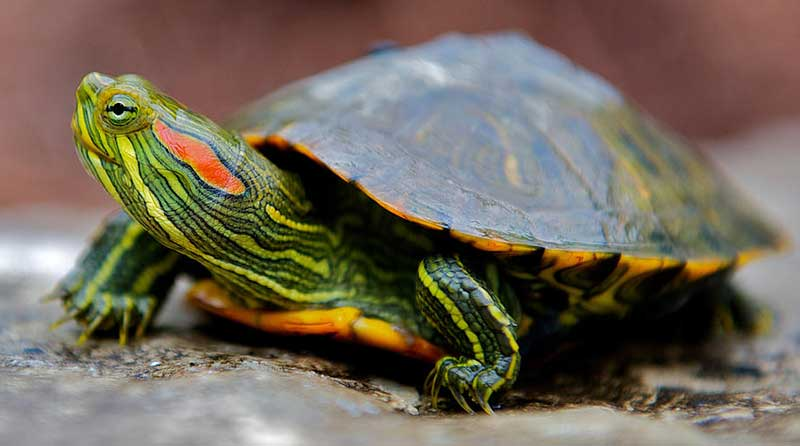
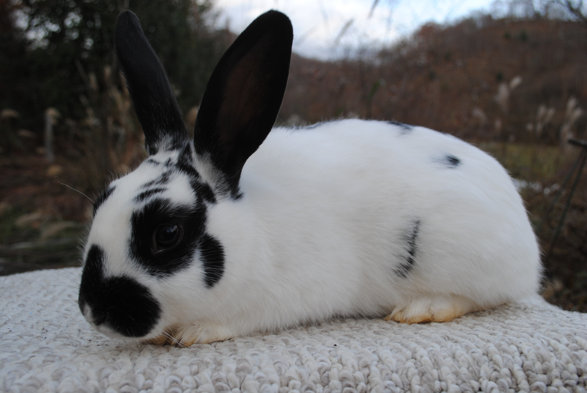
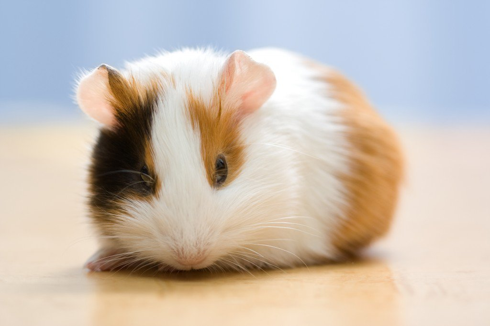

Other Animals
=============

**Our Non-Shedding Friends** 

Looking for a pal that won't coat your house in a layer of fur? 
Don't worry, we offer these types of animals to be adopted as well. 
Turtles, bunnies, and guinea pigs can be found here at our pet shelter!

Other Animal Adoption Prices
----------------------------
======================== =======
Animal                   Price
======================== =======
Rabbits                   $45.00              
Guinea Pigs               $15.00                   
Turtles                   $15.00
======================== =======

Snap
----

Snap is our turtle we hang out with at the shelter. You will commonly 
find him in the water, but we take him out of his tank for about an hour 
each day to let him roam. Make sure to keep an eye on him though, 
because this guy is not as slow as you would think.

**Pet Details:**
	* Type: Turtle
	* Breed: Red Ear Slider
	* Sex: Male
	* Age: 4.5 years
	* Color: Green with red stripes by the ear
	* Weight: 3 lbs.

**Personality Details:**
	* Loves to swim more than anything.
	* Enjoys exploring the floor of his environment.
	* Needs exercise outside of his tank.

Dixie
-----

Meet Dixie! She is very shy, and needs to be adopted by someone who has
experience with rabbits. We recommend that Dixie goes to a home that is
equipped with an area where she can hop around for a period of time 
each day.

**Pet Details:**
	* Type: Rabbit
	* Breed: Mini Rex
	* Sex: Female
	* Age: 2 years
	* Color: White with black spots
	* Weight: 6.8 lbs.

**Personality Details:**
	* Loves healthy snacks - carrots, lettuce, spinach.
	* Needs daily exercise because of high energy levels.
	* Very shy, so will do best in a home that has rabbit experience.

Squints
-------

.. figure:: squints.png
    :width: 50%

Squints is commonly referred to as "Fur Ball" here. He is friendly, but 
does not like fast movements. You must be very gentle when handling this
little guy, or else he loses trust very quickly.

**Pet Details:**
	* Type: Rabbit
	* Breed: Silver Fox
	* Sex: Male
	* Age: 4 years
	* Color: Black and grey
	* Weight: 7.2 lbs.

**Personality Details:**
	* Gets nervous around fast movements, so needs to be handled gently.
	* Loves to eat, but please don't feed him harmful things!
	* Tends to become nervous around lots of activity, so will do best in a home with more mature individuals.

Chubbs
------

This is our guinea pig, Chubbs. He is very social and vocal. He loves to
chatter his teeth and squeak. He sometimes does this during the night,
so we recommend not putting his cage in the same room where people will
be sleeping. 

**Pet Details:**
	* Type: Guinea Pig
	* Breed: Abyssinian
	* Sex: Male
	* Age: 8 months
	* Color: Tricolor
	* Weight: 2.1 lbs.

**Personality Details:**
	* Very social and loves the company of other guinea pigs or people.
	* Very vocal - has a tendency to talk during the night.
	* Will do well in any type of home with other pets.
