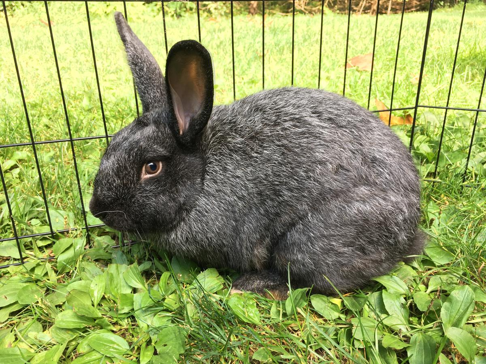

Other Animals
=============

    Non-Shedding Friends 

Looking for a pal that won't coat your house in a layer of 
brown or white fur? Don't worry, we offer these animals to
be adopted as well. Turtles, bunnies, and guinea pigs can
be found here at our pet shelter!

Snap
----

.. figure:: snap.png
    :width: 50%

Snap is our turtle we hang out with at the shelter. He is a 
Red Ear Slider that loves to swim more than anything. You will
commonly find him in the water, but he also loves to explore the
floor. We take him out of his tank for about an hour each day to
let him roam. Make sure to keep an eye on him though, because
this guy is not as slow as you would think.

Dixie
-----

Meet Dixie! She is a Mini Rex rabbit who is covered in cute black
spots. She is very shy, and needs to be adopted by someone who has
experience with rabbits. She loves to snack on hay and sniff fingers.
We recommend that Dixie goes to a home that is equipped with an area
where she can hop around for a period of time each day. She has lots
of energy and will be very happy in a place where she can exercise.

Squints
-------

Squints is commonly referred to as fur ball here. He is a Silver Fox 
rabbit who is friendly, but does not like fast movements. You must be
very gentle when handling this little guy. When we say that this guy
loves to snack, we aren't kidding. He will eat anything you put in his 
cage, but we highly recommend to only give him things that rabbits 
should eat!

Chubbs
------

.. figure:: chubbs.png
    :width: 50%

This is our guinea pig, Chubbs. He is very social, and they love the 
company of either other guinea pigs or people. He does very well 
with all types of animals. Chubbs is also very vocal and loves to 
chatter his teeth and squeak. He does this during the night at points,
so we recommend not putting his cage in the same room where people
will be sleeping. 