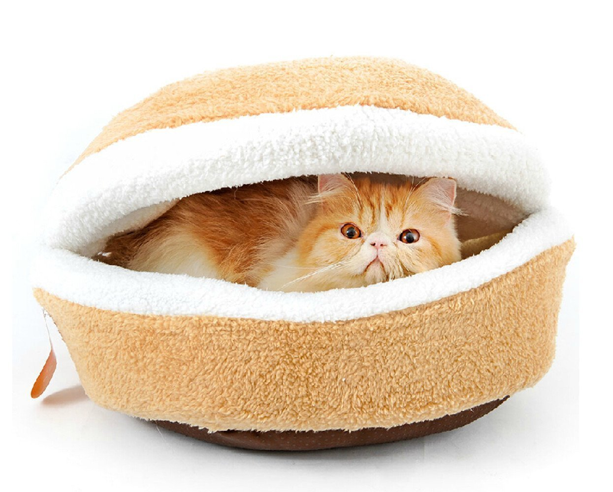

Behavior
========

    *Understanding your pet can help in several areas.*

An animals behavior can be convoluted initially, but there
are many different techniques that are useful and 
small queues to pay attention to.  An animals behavior is very broad in how to understand so on this page there are two listings of the most common household pets and their respective behavioral patterns.

Cats
----

These furry felines are independant to say the least.  From staying at home slouched on the couch to roaming outdoors barely coming in, Cats for the most part do what they please.  Don't take this in a bad way, if a cat has love for you it will definently show in how it acts around you vs other people.  Ususally towards people cats show affection by rubbing/cuddling up against you and purring.  One thing this pet value highly over many other animals is space, if a cat feels this its space is violated then it will let you know!

Dogs
----

Mans best friend holds loyalty to the highest standard.  Probably the most charismatic out of household pets, dogs are ideal for the typical outgoing guy, gal, or couple.  Dogs are incredibly loyal to their owner as long as common rules of thumb are followed.  Make sure you take them out for walks frequently and just show love.  Like anything else, these furry friends just want to be loved at the end of the day!